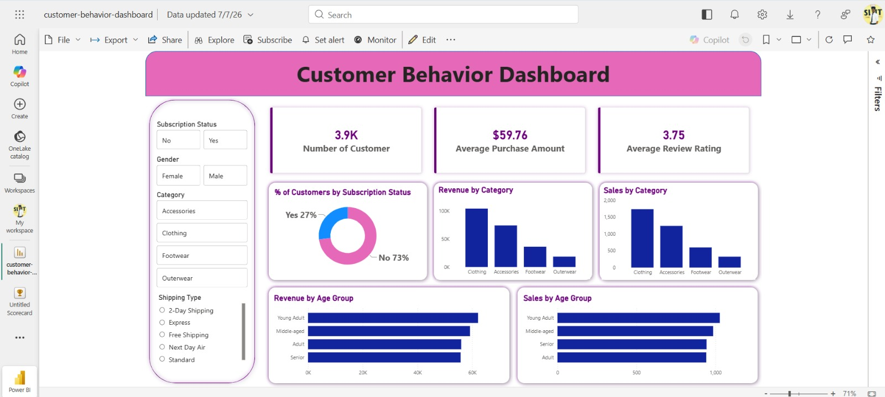

# Customer Shopping Behavior Analysis

An end-to-end data analytics project analyzing retail customer shopping behavior — from raw data to dashboard to stakeholder presentation.

## Business Problem

A retail company wanted to understand what drives customer purchasing decisions and repeat
purchases — across demographics, product categories, and factors like discounts, reviews, and
shipping preferences — in order to improve sales, engagement, and long-term loyalty.

**Business question:** How can the company leverage consumer shopping data to identify trends,
improve customer engagement, and optimize marketing and product strategies?

See [`business-problem.pdf`](./business-problem.pdf) for the full brief.

## Overview

Analyzed 3,900 retail transactions to understand what drives customer purchasing decisions and repeat purchases — including discounts, reviews, seasons, and payment methods — and turned the findings into actionable business recommendations.

## Dataset

- 3,900 transactions, 18 columns
- Customer demographics, purchase details, and shopping behavior (discounts, reviews, subscriptions, shipping, etc.)
- 37 missing values in Review Rating, handled during cleaning

## Tools

- **Python (pandas)** – data cleaning & EDA
- **SQL (PostgreSQL)** – business querying
- **Power BI** – dashboard & visualization
- **Gamma** – presentation

## Workflow

1. **Data Preparation (Python)** – Cleaned data, imputed missing review ratings, standardized columns, engineered `age_group` and `purchase_frequency_days`, loaded into PostgreSQL.
2. **Analysis (SQL)** – Queried revenue by gender, top-rated products, discount reliance, customer segmentation (New/Returning/Loyal), and revenue by age group.
3. **Dashboard (Power BI)** – Built an interactive dashboard with filters for gender, category, subscription, and shipping type.
4. **Reporting & Presentation** – Summarized findings in a project report and a Gamma presentation for stakeholders.

## Dashboard



## Key Results

- Male customers generated ~2x the revenue of female customers
- Non-subscribers drive more total revenue despite similar average spend
- Gloves, Sandals, and Boots have the highest average ratings
- Hats, Sneakers, and Coats are the most discount-dependent products
- 3,116 of 3,900 customers fall into the "Loyal" segment
- Young Adults contribute the most revenue by age group

**Recommendations:** boost subscriptions, launch loyalty programs, review discount policy, spotlight top-rated products, and target high-revenue age groups.

## How to Run

1. Clone the repo and install dependencies: `pip install pandas numpy sqlalchemy psycopg2`
2. Run `customer-shopping-behavior-analysis.ipynb` to clean the data and load it into PostgreSQL
3. Update the DB connection string and run the queries in `customer-behavior-sql-queries.sql`
4. Open `customer-behavior-dashboard.pbix` in Power BI Desktop and refresh the data
5. Review `customer-shopping-behavior-report.pdf` (report) and `customer-shopping-behavior-presentation.pptx` (presentation)

## Repository Structure

```
├── business-problem.pdf
├── customer-shopping-behavior.csv
├── customer-shopping-behavior-analysis.ipynb
├── customer-behavior-sql-queries.sql
├── customer-behavior-dashboard.pbix
├── dashboard-screenshot.png
├── customer-shopping-behavior-report.pdf
├── customer-shopping-behavior-presentation.pptx
└── README.md
```

## Author

Thabeeb — Business Analyst | Data Analyst, Dubai, UAE
